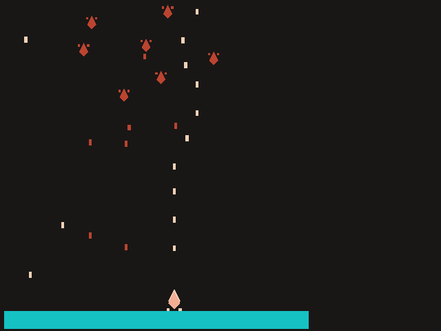

# 9S's Raiden Adventure

Author: Zi Wang

Design: \
It is a classic Raiden type shooting game. But, the bullets you shoot, will bounce around in the scene and will hurt you when it gets you. Keep shooting might make yourselve more difficult.\
Enemies spawn by waves, following points that compose a route. However, everthing, the number of enemies, the routes they follow are totally randomized.\
Whenver you kill a nubmer of enemies, the game diffficulty level will increase. See how long you can hold!

Screen Shot:

How To Play:\
WASD/UP DOWN LEFT RIGHT to move\
SPACE to shoot\
R to reset the game\
ESCAPE to close the game

Sources: 

This game was built with [NEST](NEST.md).
